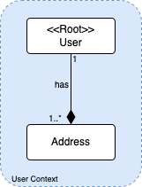
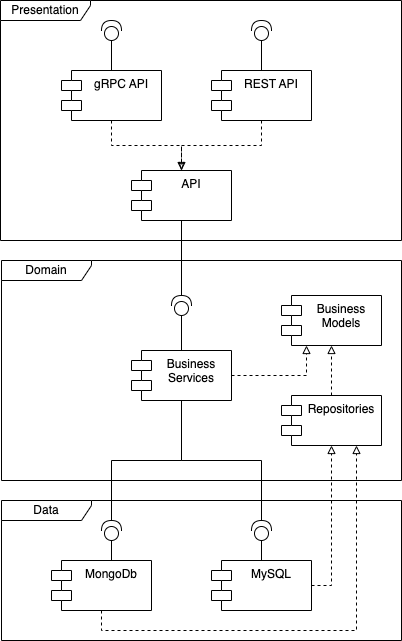

# Sample Service Architecture

## Table of Contents

1. [Design Objective](#design-objective)
2. [Design Inputs](#design-inputs)
   1. [Use Cases](#use-cases)
   2. [Quality Attributes Scenarios](#quality-attributes-scenarios)
   3. [Constraints](#constraints)
   4. [Architectural Concerns](#architectural-concerns)
3. [Analysis](#analysis)
   1. [Diagrams](#diagrams)
4. [Implementation](#implementation)
   1. [Presentation Layer](#application-layer)
   2. [Domain Layer](#business-layer)
   3. [Data Layer](#data-layer)
   4. [Deployment](#deployment)
5. [Conclusions](#conclusions)
4. [References](#references)

## Design Objective

This repository aims to present a hexagonal architecture of a Java application which also intends to answer to some architectural drivers through ADD (Attribute Drive Design) iterations.

Consequently, a proof-of-concept has been developed to model some basic use cases to prove the concept exposed.

## Design Inputs

### Use Cases

The architecturally significant technical & functional, use cases & requirements:

| Id       | Use Case                                                                 |
|----------|--------------------------------------------------------------------------|
| **UC-1** | Downstream services can send requests using multiple API protocols       |
| **UC-2** | It is possible to use multiple data sources                              |
| **UC-3** | Highly prepared to be integrated within a CI/CD pipeline to deliver fast |

### Quality Attributes Scenarios

The quality attributes / non-functional requirements (NFRs) relevant to this design and how they relate to the use cases listed above:

| ID       | Quality Attribute | Scenario                                                                                | Associated Use Cases Ids |
|----------|-------------------|-----------------------------------------------------------------------------------------|--------------------------|
| **QA-1** | Automation        | Automated local deployment to Docker and database initialization                        | UC-3                     |
| **QA-2** | Modularity        | Have the business logic separate and independent of presentation and persistence layers | UC-2                     |
| **QA-3** | Integration       | Highly integrated from the start, providing multiple API protocols                      | UC-1, UC-2               |
| **QA-4** | Portability       | Deployable to container making easier to move the application between environments      | UC-3                     |

### Constraints

Limitations or restrictions on this design:

| ID       | Constraint                |
|----------|---------------------------|
| **CON1** | Run on JVM or native mode |
| **CON2** | Framework independent     |

### Architectural Concerns

Other concerns, external drivers, etc.

| ID       | Scenario                                                             |
|----------|----------------------------------------------------------------------|
| **CRN1** | Limited resources to deploy into multiple environments and platforms |
| **CRN2** | Highly integrated from the start, providing multiple API protocols   |

## Analysis

In this section the architecture of this project is explained through a set of diagrams.

### Diagrams

#### Domain Model

The domain model of this application is very simple as this project is just a PoC and intends to address the design inputs stated above.



#### Components View

The following diagram shows the main components of this hexagonal architecture and which are the dependencies between them.



Some notes should be taken having in mind this diagram:
- The presentation layers implements two API protocols - REST and gRPC - based on a Java API that call the business services
- The business layer has no dependencies to other layers, in particular the business model component is completely isolated
- The data layer expose two datasources - MongoDB and MySQL - and each one of them implements the repository interfaces provided by the domain layer

## Implementation

[WIP]

### Presentation Layer

[WIP]

### Domain Layer

[WIP]

### Data Layer

[WIP]

### Deployment

To deploy this application and to address QA-1 the bootstrap.sh has been developed and can be executed as stated below to show the available options:

```shell
./bootstrap.sh -h
```

## Conclusions

[WIP]

## References 

* https://netflixtechblog.com/ready-for-changes-with-hexagonal-architecture-b315ec967749
