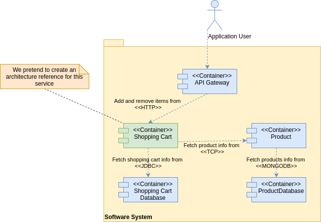

# Sample Service Architecture

# Table of Contents

1. [Overview](#overview)
2. [Drivers](#drivers)
3. [Analysis](#analysis)
    1. [Diagrams](#diagrams)
4. [Implementation](#implementation)
   1. [Starters](#starters)
   2. [Application Layer](#application-layer)
   3. [Business Layer](#business-layer)
   4. [Data Layer](#data-layer)
   5. [Deployment](#deployment)
5. [Conclusions](#conclusions)
4. [References](#references)

## Overview

In this repository we present a Java application architecture which aims to answer to some technical challenges.
These technical challenges were collected as drivers to be addressed by some ADD (Attribute Drive Design) iterations.

Thus, we started from an existing software system that allows to add and remove items from a shopping cart, and we pretend to replace the current shopping cart service for a new one that presents the new architecture explored.

## Drivers

| Driver     | Iteration | Type          | Description                                                                                              |
|------------|-----------|---------------|----------------------------------------------------------------------------------------------------------|
| **CRN1**   | 1         | Concern       | *Modularity:* Have a layered architecture                                                                |
| **CRN2**   | 1         | Concern       | *Monitoring:* Use Elastic APM to monitor application                                                     |
| **CON1**   | 1         | Constraint    | *Integrity:* Integrate with NestJs services that use TCP as transport layer                              |
| **CON2**   | 1         | Constraint    | Use Spring Data as the indirection layer with the persistence                                            |
| **CON3**   | 1         | Constraint    | Deploy the application inside a docker container                                                         |
| **CON4**   | 1         | Constraint    | Use Kubernetes to orchestrate the container                                                              |
| **QA1**    | 1         | Quality       | *Compatibility:* Make possible start the application with different frameworks (Quarkus and Spring Boot) |
| **UC1**    | 1         | Functionality | Add item to shopping cart                                                                                |
| **UC2**    | 1         | Functionality | Remove item from shopping cart                                                                           |
| **CRN3**   | 2         | Concern       | *Monitoring*: Integrate the application logs with the ELK stack                                          |
| **CRN4**   | 2         | Concern       | *Modularity:* Separate business workflow from business logic and entities                                |

## Analysis

In this chapter we provide some analysis details such as components and domain diagrams.

### Diagrams

#### Domain Model


#### Containers View



#### Components View


## Implementation

In this chapter we aim to provide some important implementation details in terms of Maven dependencies and patterns.

### Starters

As described in the Drivers chapter we intended to make it possible to start the application with different frameworks such as Quarkus and Spring Boot.

So, we studied how we could achieve such goal, and we discovered that Quarkus has a CDI implementation named Quarkus DI (also called ArC). However, it is not a full CDI implementation, only a subset of the CDI features is implemented (list of supported features https://quarkus.io/guides/cdi-reference#supported_features).

Therefore, because we start our implementation oriented to Spring Boot we found two important things:

1. To have CDI with Quarkus we need to have the Jandex plugin configured for each Maven module in order to index all the dependencies at build time;
2. Because Quarkus is only a subset of the CDI features does not support the resource annotation which was replaced by inject annotation.

Hence, we found a large common base that make possible to start an application with both: Quarkus and Spring Boot.

Our strategy was: 

1. Mark all the dependencies between our project modules as provided and make each starter module responsible to provide this dependencies in compile or runtime
2. Have dependencies only for interfaces modules and not implementations then each starter module is responsible to provide this dependencies in compile or runtime
3. Create separate contexts for Spring and Quarkus.

### Application Layer

At the application layer level we chose to have an implementation of our API and a module for each architectural style.

In this architectural reference we only provide a REST API as an example, but this architecture is thought to support different architectural styles like SOAP, RPC, among others, because of the modularity approach. 

Thus, for REST API we opt for the JAX-RS specification. Choosing the JAX-RS specification we provide two different implementations of the RESTeasy, one for Quarkus and other for Spring Boot, each one imported its starter.


### Business Layer

At the business layer we made the decision of separate domain models from services because in the next iteration we intended to create a new module with the responsibility of business workflows. By other hand having this two modules we really made the domain services as the domain boundary with these modules we really pretend to have a DDD approach as it is presented next with some cases of fine granularity.

#### Communicate with other bounded contexts

When we need to communicate with another bounded context we may have the constraint that the other bounded context is a service implemented in NestJS using TCP as transport layer. As there is no solution to integrate a non-NestJS service we develop a library that allows this integration (for more information the [Github repository](https://github.com/brunofigalves/nestjs-tcp-adapter)).

### Data Layer

At the data layer we pretended since the beginning to use Spring Data because we strongly believe that Spring Data is the best framework to handle with the persistence making possible with the same interface use different persistence technologies.


Therefore, in our data access module we only have a dependency for Spring Data Commons, like the previous example of the JAX-RS, the starters are responsible to provide this implementations.


#### Database Version Control

For versioning control of the database, we decided to use Liquibase. Liquibase presents a plugin for Maven where it is possible to execute multiple operation, but we want to highlight:

* *Update*: deploys any changes that are in the changelog file and that have not been deployed to your database yet;
* *Rollback*: allows you to roll back change you made to the database. It also marks changesets that were deployed as unapplied; 
* *Status*: produces a list of pending changesets with additional information that includes the id, author, and file path name. The status goal does not modify the database, it prints the output with changesets that need to be applied to the database.

So, as we can see this plugins presents an easy integration with your CI/CD workflow.

### Deployment

#### Docker

For the deployment we chose to create Docker images of the current application. We can create a Docker image for Spring Boot or Quarkus.

To create an image for Spring Boot we only need to execute the following command in the *sample-service-spring-boot-starter* module:

```bash
docker build -t <IMAGE_NAME> .
```

For Quarkus, we have two options to build a Docker image which runs in:
2. JVM mode;
3. In Native mode.

For both we have to execute the following command on *sample-service-quarkus-starter* module:

```bash
docker build -f <DOCKER_FILE_PATH> -t <IMAGE_NAME> .
```

Therefore, to achieve good integration with your CI/CD workflow this image must be published on the Docker Hub. 

*Note: we suggest building the Docker image with the name *sample-app* because the Kubernetes configuration files already are configured to recognize these name.*

#### Kubernetes

After building the Docker images, we can now deploy our application and database to the Kubernetes cluster.

* *database-configmap.yml*: in this file are indicated some properties to be used in PostgreSQL, such as: database name, user and password.
* *database-storage.yml*: in this file a volume is configured at the level of Kubernetes so that data is not lost when the container is stopped or removed.
* *database-deployment.yml*: in this file the PostgreSQL deployment is configured with emphasis on the container port, and the volume to be used for persistence.
* *database-service.yml*: in this file the service is configured, and the container ports are mapped (cluster and exposed port).

* *application-deployment.yml*: in this file the configuration of the deployment is indicated to note that only 1 replica is configured for sample-service.
* *application-service.yml*: in this file the service is configured, and the container ports are mapped (cluster and exposed port).

Thus, in the */k8s* folder, the following commands must be executed to create the deployment and make the service available in the Kubernetes cluster:

*Database*:
```bash
kubectl create -f database-configmap.yml 
kubectl create -f database-storage.yml 
kubectl create -f database-deployment.yml 
kubectl create -f database-service.yml
```

*Application*:
```bash
kubectl create -f application-configmap.yml 
kubectl create -f application-deployment.yml 
kubectl create -f application-service.yml
```

To remove from the Kubernetes cluster:

*Database*:
```bash
kubectl delete service sample-db-service 
kubectl delete deployment sample-db-deployment 
kubectl delete configmap sample-db-config 
kubectl delete persistentvolumeclaim sample-db-pv-claim
kubectl delete persistentvolume gample-db-pv-volume
```

*Application*:
```bash
kubectl delete service sample-app-service 
kubectl delete deployment sample-app-deployment 
kubectl delete configmap sample-app-config
```

### Monitoring

In progress...

## Conclusions

In this iteration we managed to address all the objectives. However, when we pay attention to the current business logic layer we realize that services and workflows are in the same module and can be separated.

We think we can benefit in the future from this separation because workflows could be designed using tools like BPMN and CMMN.

## References 

* https://quarkus.io/guides/cdi-reference
* https://blog.codecentric.de/en/2011/12/spring-data-commons/
* https://docs.liquibase.com/tools-integrations/maven/commands/home.html